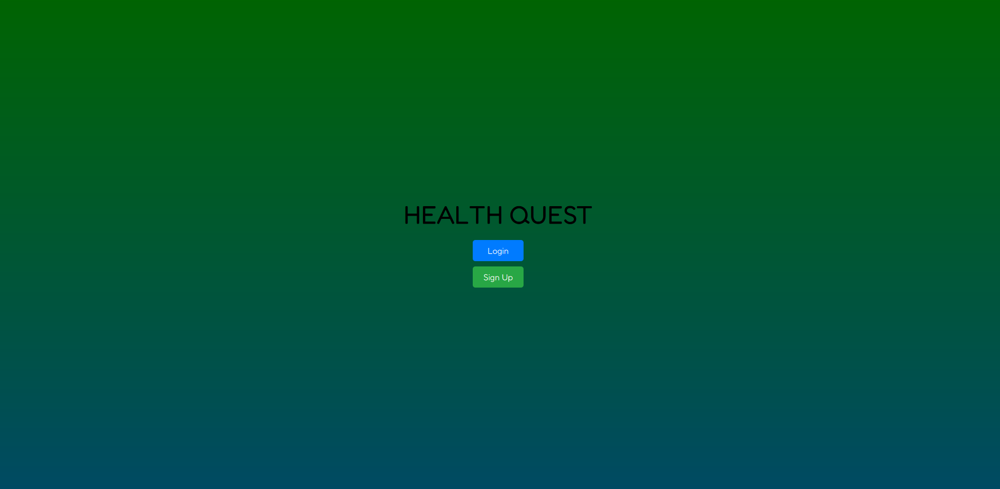
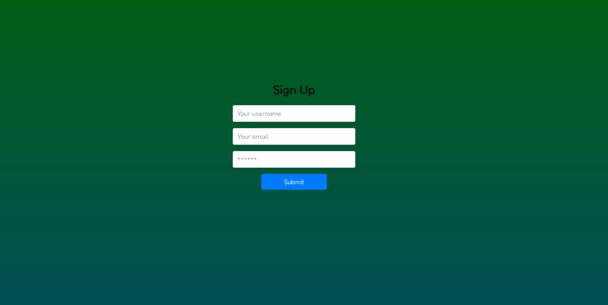
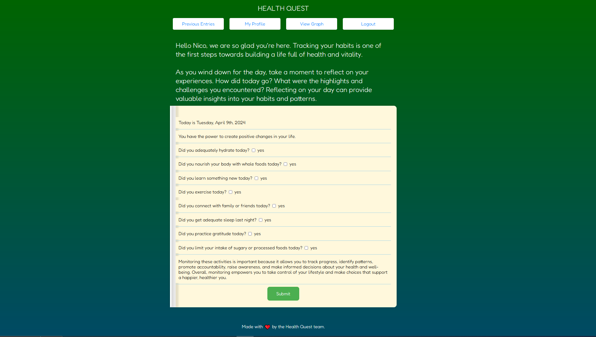
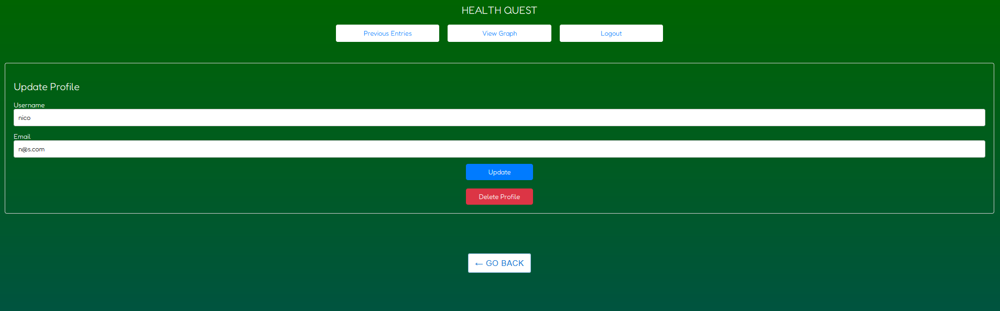

# Health Quest

## Description
Health Quest Habit Tracker is a full-stack web application built using the MERN stack (MongoDB, Express.js, React, Node.js) to help users track and maintain healthy habits. Whether you're looking to improve your fitness routine, manage your nutrition, or focus on mental wellness, Health Quest provides the tools and features to support your journey towards a healthier lifestyle.

***What was our motivation?***
Our motivation for building the Health Quest Habit Tracker application stemmed from a desire to create a tool that promotes and facilitates healthier lifestyles. We recognized the importance of habits in achieving long-term health and wellness goals, and we wanted to provide users with a user-friendly platform to track and maintain their habits effectively.

***Why did we build this project?***

We built this project because we saw a need for a comprehensive habit tracking solution that integrates seamlessly into users' daily lives. Rather than relying on multiple apps or manual tracking methods, we wanted to offer a centralized platform where users can easily monitor their habits, receive personalized insights, and stay motivated on their health journey.

***What problem does it solve?***

The Health Quest Habit Tracker addresses the challenge of establishing and maintaining healthy habits in today's fast-paced world. It simplifies the habit tracking process, empowers users to set and achieve their health goals, and provides valuable feedback and encouragement along the way. By offering features such as visual progress tracking, the application helps users overcome common barriers to habit formation and fosters long-term behavior change.

***What did we learn?***

Throughout the development of Health Quest Habit Tracker, we gained valuable insights and experiences in various areas, including:
Full-stack Development: We deepened our understanding of the MERN stack (MongoDB, Express.js, React, Node.js) and learned how to integrate frontend and backend components to create a cohesive web application.
User Authentication: We implemented secure user authentication using JSON Web Tokens (JWT) to protect user data and ensure a safe and personalized experience for each user.
Data Visualization: We explored different data visualization libraries such as Chart.js and React-Chartjs-2 to create interactive charts and graphs that enhance the user experience and provide valuable insights into habit progress.
Deployment: We gained experience deploying web applications using platforms like Render, enabling us to share our project with a wider audience and showcase our work to potential users and collaborators.

## Table of Contents

- [Features](#features)
- [Installation](#installation)
- [Usage](#usage)
- [Screenshots](#screenshots)
- [Credits](#credits)
- [License](#license)

## Features

- User Authentication: Secure user authentication system allows users to sign up, log in, and access their personalized habit tracking dashboard.
- Habit Tracking: Create, update, and delete custom habits to track daily progress towards health and wellness goals.
- Visual Progress Tracking: Interactive charts and graphs visualize habit streaks, completion rates, and overall progress, providing motivation and insight into user habits.
- Responsive Design: The application is fully responsive and optimized for use on desktop, tablet, and mobile devices, ensuring a seamless user experience across all platforms.

## Installation

Follow these steps to install and set up the project: 
1. **Clone the Repository:** `git clone git@github.com:NewManuel/Health-Quest.git` 
2. **Navigate to Project Directory:** `cd Health-Quest` 
3. **Install Dependencies:** `npm install` 
4. **Start the Application:** `npm run dev`
5. **Access the Application:** Once the application is running, access it through a web browser or command line interface as per your project's specifications. You may need to navigate to `localhost/3000` 

## Usage

Follow these steps to use the project:

1. **Access the Application:**
   Open your web browser and navigate to the [site](https://health-quest-gun9.onrender.com/).
2. **Create an Account:**
   If you're accessing the application for the first time, you may need to create an account. Look for the "Sign Up" link on the application's homepage and follow the prompts to create a new account. You will be required to provide an email address, username, and password.

3. **Interact with the Application:**
   Once logged in, explore the features and functionalities provided by the application. This may include creating, editing, or deleting content, and managing settings.

5. **View Results:**
   As you interact with the application, view the results or output according to the actions performed. 

## Screenshots

Below are screenshots showcasing various features of the application:

1. **Home Page:**
   

2. **Create Account Form:**
   

3. **User Dashboard:**
   

4. **Profile Page:**
   

## Credits

[Nick Smith](https://github.com/nicklearning), [Mario Partida](https://github.com/mariop578), [Anthony Castillo](https://github.com/ac1745198), [Emmanuel Nwabueze](https://github.com/NewManuel)

## License

MIT License

